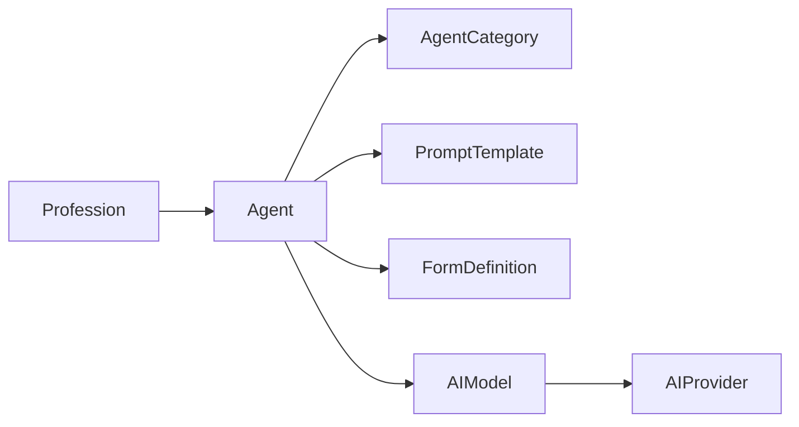

# Framework Universal de Agentes

O Framework Universal de Agentes é o núcleo reutilizável do Veltis Workspace para execução assistida por IA em qualquer profissão.

## Princípio

O motor não conhece profissão específica. O comportamento muda por configuração:

- prompts;
- formulários;
- templates;
- categorias;
- regras;
- ferramentas futuras.

## Componentes

## Garantia arquitetural

Novas profissões devem criar dados e configurações. Não devem alterar o núcleo do motor.

