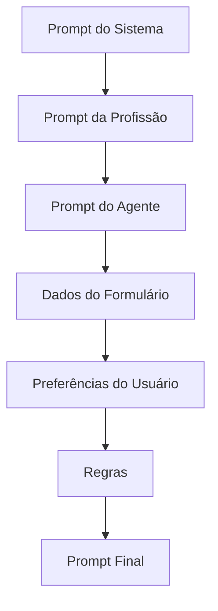

# Prompt Builder

O Prompt Builder compõe o prompt final em etapas substituíveis.

## Contratos

- `IPromptBuilder`
- `IPromptRenderer`

## Implementação inicial

`PromptBuilder` concatena seções de contexto e usa `PromptRenderer` para substituir variáveis no formato `{{variável}}`.

