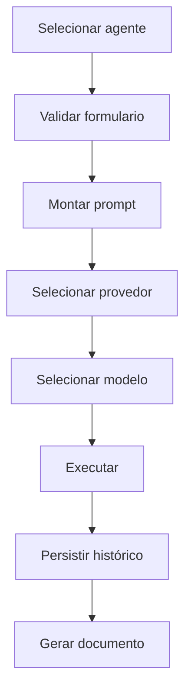

# Pipeline de Execução

O pipeline de execução segue etapas substituíveis:

## Contratos

- `IAgentService`
- `IAgentExecutor`
- `IFormRenderer`
- `IAIModelSelector`
- `IAgentFactory`
- `IAgentHistoryService`
- `IDocumentGenerator`

## Estratégias

- Factory Pattern para provedor.
- Stratégy Pattern para execução.
- Builder Pattern para prompt.
- Dependency Injection para substituicao de componentes.

