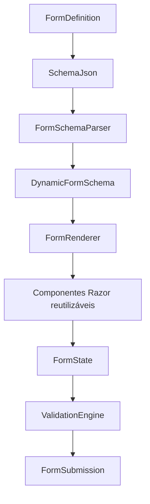

# Dynamic Form Engine

## Objetivo

O Dynamic Form Engine é a fundação responsável por gerar formulários profissionais a partir de definições JSON. O mesmo motor deve atender Professor, Advogado, Médico, Contador, Engenheiro e qualquer profissão futura, sem criação de telas específicas por profissão.

## Princípios

- Formulários são descritos por metadados.
- A interface é renderizada dinamicamente.
- Validações são declarativas.
- Alterações geram novas versões.
- Dados preenchidos são persistidos sem acionar IA.
- Componentes visuais são reutilizáveis.

## Fluxo

## Responsabilidades

| Componente | Responsabilidade |
| --- | --- |
| `FormDefinition` | Armazenar metadados, schema, UI schema, validações, categoria, ícone, publicação e versão. |
| `FormSchemaParser` | Interpretar o JSON e produzir o modelo tipado do formulário. |
| `FieldFactory` | Converter campos declarados em modelos de renderização. |
| `FormRenderer` | Preparar o formulário para a interface. |
| `ValidationEngine` | Aplicar regras de validação declaradas no schema. |
| `FormStateService` | Controlar valores, erros, campos alterados, tocados, ocultos e somente leitura. |
| `FormVersioningService` | Criar novas versões sem sobrescrever versões anteriores. |
| `FormSubmissionService` | Persistir dados preenchidos. |

## Escopo Atual

O motor prepara a renderização dinâmica, validação, estado, preview, persistência de submissões e versionamento. Não há integração com IA, chat, geração de documentos, exportação PDF, exportação Word, Marketplace ou Comunidade.

