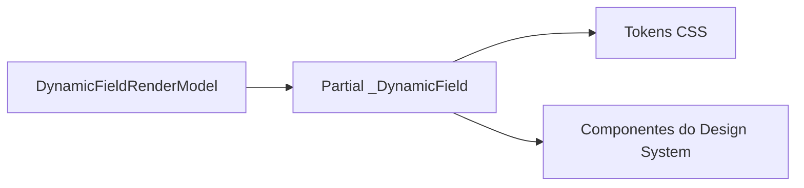

# Biblioteca de Componentes

## Objetivo

A biblioteca de componentes centraliza os elementos visuais reutilizáveis do Veltis Workspace. Ela deve reduzir duplicação, padronizar interações e permitir que o Dynamic Form Engine renderize interfaces consistentes.

## Componentes Iniciais

| Componente | Localização | Situação |
| --- | --- | --- |
| Button | `Views/Shared/DesignSystem/_Button.cshtml` | Base criada |
| Card | `Views/Shared/DesignSystem/_Card.cshtml` | Base criada |
| Input | `Views/Shared/DesignSystem/_Input.cshtml` | Base criada |
| Textarea | `Views/Shared/DesignSystem/_Textarea.cshtml` | Base criada |
| Select | `Views/Shared/DesignSystem/_Select.cshtml` | Base criada |
| Checkbox | `Views/Shared/DesignSystem/_Checkbox.cshtml` | Base criada |
| Switch | `Views/Shared/DesignSystem/_Switch.cshtml` | Base criada |
| DatePicker | `Views/Shared/DesignSystem/_DatePicker.cshtml` | Base criada |
| FileUpload | `Views/Shared/DesignSystem/_FileUpload.cshtml` | Base criada |
| Badge | `Views/Shared/DesignSystem/_Badge.cshtml` | Base criada |
| Alert | `Views/Shared/DesignSystem/_Alert.cshtml` | Base criada |
| Modal | `Views/Shared/_Modal.cshtml` | Existente |
| Drawer | `Views/Shared/DesignSystem/_Drawer.cshtml` | Base criada |
| Table | `Views/Shared/DesignSystem/_Table.cshtml` | Base criada |
| DataGrid | `Views/Shared/DesignSystem/_DataGrid.cshtml` | Base criada |
| Pagination | `Views/Shared/DesignSystem/_Pagination.cshtml` | Base criada |
| Breadcrumb | `Views/Shared/_Breadcrumb.cshtml` | Existente |
| Tabs | `Views/Shared/DesignSystem/_Tabs.cshtml` | Base criada |
| Toast | `Views/Shared/DesignSystem/_Toast.cshtml` | Base criada |
| Tooltip | `Views/Shared/DesignSystem/_Tooltip.cshtml` | Base criada |
| Spinner | `Views/Shared/DesignSystem/_Spinner.cshtml` | Base criada |
| Skeleton | `Views/Shared/DesignSystem/_Skeleton.cshtml` | Base criada |
| EmptyState | `Views/Shared/DesignSystem/_EmptyState.cshtml` | Base criada |

## Uso pelo Dynamic Form Engine

## Evolução

Os componentes devem continuar pequenos, reutilizáveis e sem regra de negócio. Regras de schema, validação e estado permanecem na camada Application.

