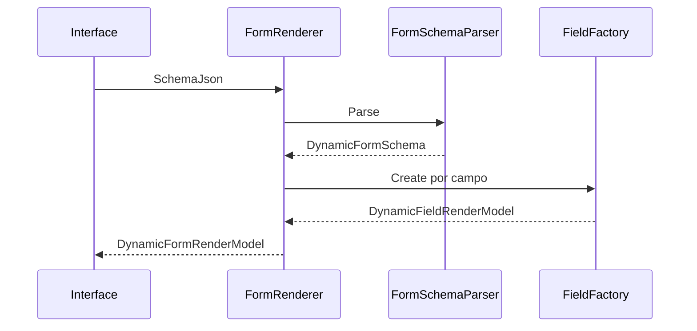

# Form Renderer

## Objetivo

O Form Renderer converte o `SchemaJson` de um formulário em um modelo de renderização consumido pelas partials Razor. Ele não contém regras específicas de profissão e não executa IA.

## Contrato

```csharp
public interface IFormRenderer
{
    DynamicFormRenderModel Render(string schemaJson, string? uiSchemaJson = null, bool isPreview = false);
}
```

## Pipeline



## Preview

O modo Preview é tratado por `DynamicFormRenderModel.IsPreview`. A interface pode exibir o formulário antes da publicação, mantendo os dados isolados do fluxo definitivo.

## Compatibilidade

O contrato antigo usado pelo Framework Universal de Agentes foi preservado. O novo motor fica em `Veltis.Workspace.Application.Forms`, evitando acoplamento com execução de agentes.

