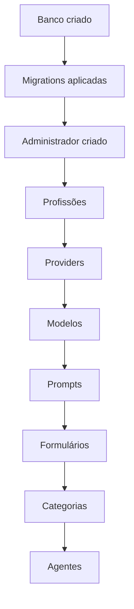

# Configuração Inicial do Sistema

## Objetivo

Este documento orienta a preparação do primeiro ambiente do Veltis Workspace usando o Painel Administrativo Inicial.

## Passo a Passo

1. Criar o banco PostgreSQL `veltis_workspace`.
2. Configurar a connection string local em `src/Veltis.Workspace.Web/appsettings.Development.json`.
3. Rodar migrations com Entity Framework Core.
4. Criar um usuário administrador.
5. Cadastrar profissões.
6. Cadastrar providers de IA, sem armazenar API keys nesta sprint.
7. Cadastrar modelos de IA.
8. Cadastrar prompt templates.
9. Cadastrar formulários dinâmicos com JSON válido.
10. Cadastrar categorias de agentes.
11. Cadastrar agentes relacionando profissão, categoria, prompt, formulário e modelo.

## Usuário Administrador

O projeto possui seed de roles e administrador controlado por configuração. Não há senha real hardcoded. Para habilitar o seed inicial, use variáveis de ambiente ou secrets:

```powershell
$env:Seed__RunOnStartup="true"
$env:Seed__AdminUser__Email="admin@exemplo.local"
$env:Seed__AdminUser__Password="SENHA_FORTE_LOCAL"
```

Depois execute a aplicação para que o seed seja processado. Em ambientes compartilhados, use secrets do ambiente e não arquivos versionados.

## Ordem Recomendada



## Observações

O painel prepara os dados de configuração. Execução real de agentes, integração com IA, geração de documentos, Marketplace e Comunidade continuam fora do escopo desta sprint.

