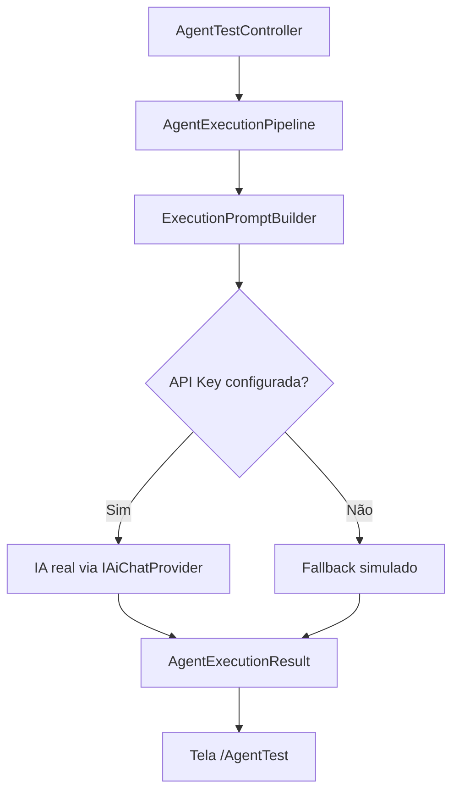

# Integração Inicial com IA

## Objetivo

A Sprint 2.4 substitui a resposta simulada fixa do pipeline por uma chamada real de IA quando houver API Key configurada. Sem API Key, o sistema mantém fallback simulado explícito para preservar a experiência de desenvolvimento.

## Fluxo

## Comportamento

- O prompt é montado pelo `ExecutionPromptBuilder`.
- A configuração é lida da seção `AI`.
- Com `AI__OpenAI__ApiKey` preenchida, o pipeline chama o provider real.
- Sem API Key, o pipeline retorna resposta simulada com aviso claro.
- O prompt completo não é registrado em log.

## Tela de Teste

A rota `/AgentTest` exibe provider, modelo, prompt gerado, resposta, tokens, custo estimado e mensagem de fallback quando aplicável.

